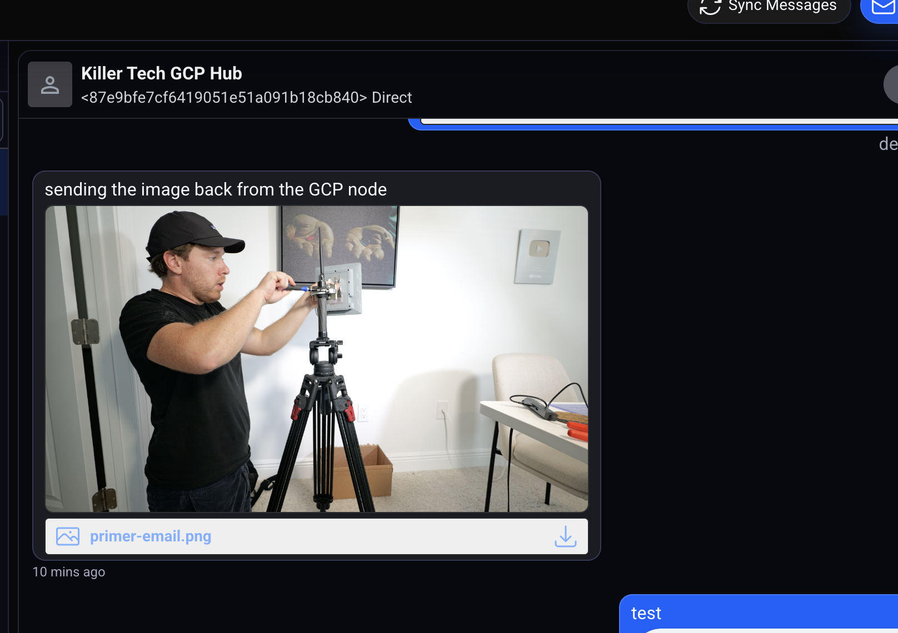

<p align="center">
  <a href="https://github.com/buildwithparallel/crosstalk">
    
  </a>
</p>

<h1 align="center">Crosstalk</h1>

<p align="center">
  A field-focused fork of <a href="https://github.com/liamcottle/reticulum-meshchat">Reticulum MeshChat</a> for resilient messaging over Reticulum, including native Iridium IMT support.
</p>



## What Crosstalk adds

Crosstalk keeps MeshChat's LXMF messaging, attachments, audio calls, propagation-node support and Nomad Network browser, then adds the following.

### Iridium IMT transport

- Native Reticulum interface for a USB-connected RockBLOCK 9704.
- Complete encrypted Reticulum packets sent over Iridium Messaging Transport.
- Duplicate inbound packet suppression.
- Bounded LXMF retry behavior designed to avoid waste on paid, high-latency satellite links.
- Delivery and signal-status feedback in the conversation UI.
- Allowlisted path persistence for restoring selected Iridium routes without generating satellite traffic.

See [RockBLOCK 9704 / Iridium IMT setup](./docs/crosstalk_on_raspberry_pi.md#rockblock-9704--iridium-imt).

### Better network visibility and configuration

- A dedicated Infrastructure view for signed Reticulum interface advertisements.
- Infrastructure nodes, hop counts, radio parameters and connection state in the network map.
- Public-backbone onboarding, including a disabled-by-default RMAP World connection.
- Improved interface import, export, editing and deletion.
- Automatic backend restarts after configuration changes.
- An isolated Crosstalk Reticulum configuration so another local Reticulum instance cannot leave the app using stale settings.

### Field-ready interface

- A redesigned, higher-contrast desktop and mobile UI.
- Clearer navigation, deterministic identicons and improved network-map controls.
- Consistent in-app dialogs, notifications and status feedback.
- Better attachment previews, attachment-only messages and mobile chat controls.

### Raspberry Pi fallback networking

- Raspberry Pi deployment documentation and service examples.
- An optional network supervisor that prefers saved Wi-Fi, then a saved mobile hotspot, and finally creates an `Aspen-Iridium-Pi` access point for direct local access.

See [Raspberry Pi setup](./docs/crosstalk_on_raspberry_pi.md) and [Aspen Pi network fallback](./deploy/pi/network/README.md).

## Install

Download a packaged build for Windows, macOS or Linux from [Releases](https://github.com/buildwithparallel/crosstalk/releases).

Other supported setups:

- [Docker](./docs/crosstalk_on_docker.md)
- [Raspberry Pi](./docs/crosstalk_on_raspberry_pi.md)
- [Android with Termux](./docs/crosstalk_on_android_with_termux.md)

To run from source, install Python 3 and Node.js 18 or newer, then:

```sh
git clone https://github.com/buildwithparallel/crosstalk.git
cd crosstalk
npm install --omit=dev
npm run build-frontend
python3 -m pip install -r requirements.txt
python3 crosstalk.py
```

Open <http://localhost:8000>. Run `python3 crosstalk.py --help` for server, identity, storage and Reticulum configuration options.

## Development

```sh
python3 -m pip install -r requirements.txt
npm install
npm run build-frontend
python3 crosstalk.py --headless
```

Use `npm run electron` to build and launch the Electron app locally, or `npm run dist` to create a packaged build for the current platform.

## Upstream and compatibility

Crosstalk is based on [Reticulum MeshChat](https://github.com/liamcottle/reticulum-meshchat) and remains compatible with LXMF clients such as [Sideband](https://github.com/markqvist/Sideband) and [NomadNet](https://github.com/markqvist/nomadnet).

It uses the [Reticulum Network Stack](https://github.com/markqvist/Reticulum) and can communicate over any configured Reticulum interface, including TCP, local networks, RNode/LoRa and the Crosstalk Iridium IMT interface.

## License

[MIT](./LICENSE)
